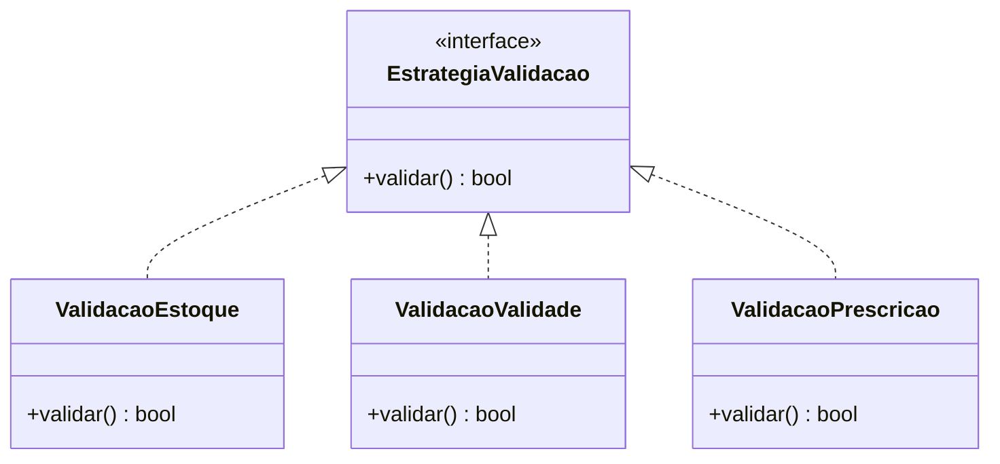

# PharmaCare-POO-Final
Projeto final de POO com tema de um sistema para gerenciar a dispensação e entrega de medicamentos aos pacientes, seguindo tratamentos prescritos por profissionais de saúde. Destaque da disciplina: permite trabalhar associação, composição, herança, polimorfismo e encapsulamento de forma integrada.

# PharmaCare — Gerenciamento de Medicamentos

Sistema de gerenciamento de medicamentos desenvolvido para a disciplina de **Programação Orientada a Objetos (POO)**.

O PharmaCare tem como objetivo auxiliar no gerenciamento de **pacientes, profissionais, medicamentos, prescrições, tratamentos, estoque, lotes e entregas**, aplicando conceitos de orientação a objetos como **encapsulamento, herança, polimorfismo, associação e composição**. 

---

## Sumário

* [1. Arquitetura de Classes](#1-arquitetura-de-classes)
* [2. Tipos Abstratos de Dados](#2-tipos-abstratos-de-dados--tad)
* [3. Estruturas de Dados](#3-estruturas-de-dados)
* [4. Padrões de Projeto](#4-padrões-de-projeto)
* [5. Interações](#5-interações)
* [6. Configuração](#6-configuração)
* [7. Regras de Negócio](#7-regras-de-negócio)
* [8. Estrutura do Projeto](#8-estrutura-do-projeto)

---

# 1. Arquitetura de Classes

## 1.1 Classes

| Classe               | Responsabilidade                                                     |
| -------------------- | -------------------------------------------------------------------- |
| `Usuario`            | Classe abstrata com informações e comportamentos comuns aos usuários |
| `Paciente`           | Representa o paciente e seus tratamentos, prescrições e histórico    |
| `Medico`             | Responsável pela emissão de prescrições                              |
| `Farmaceutico`       | Responsável pela conferência e entrega dos medicamentos              |
| `Medicamento`        | Representa um medicamento cadastrado                                 |
| `Prescricao`         | Representa uma prescrição médica                                     |
| `ItemPrescrito`      | Representa um medicamento dentro de uma prescrição                   |
| `Tratamento`         | Representa o tratamento de um paciente                               |
| `Estoque`            | Responsável pelo controle dos medicamentos disponíveis               |
| `Lote`               | Controla quantidade e validade de um lote                            |
| `EntregaMedicamento` | Registra a entrega de medicamentos                                   |

## 1.2 Relacionamentos

### Herança

```text
Usuario
├── Paciente
├── Medico
└── Farmaceutico
```

### Associação

Um médico pode emitir várias prescrições e um paciente pode possuir várias prescrições.

```text
Medico ─────── Prescricao ─────── Paciente
```

### Composição

Uma prescrição é composta por itens prescritos.

```text
Prescricao
├── ItemPrescrito
├── ItemPrescrito
└── ItemPrescrito
```

### Agregação

Um estoque pode possuir diversos lotes.

```text
Estoque
├── Lote
├── Lote
└── Lote
```

---

# 2. Tipos Abstratos de Dados — TAD

Os Tipos Abstratos de Dados (TAD) especificam os dados armazenados pelas classes e as operações que podem ser realizadas sobre eles.

Além dos atributos e métodos, são definidas pré-condições e pós-condições para garantir o comportamento esperado.

---

## 2.1 TAD — Medicamento

### Atributos

```text
codigo: string
nome: string
fabricante: string
dosagem: string
tipo: string
```

### Métodos

```text
consultarEstoque()
adicionarEstoque(quantidade)
removerEstoque(quantidade)
verificarDisponibilidade(quantidade)
```

### Pré-condições

* `quantidade > 0`;
* Para remoção, a quantidade solicitada deve estar disponível.

### Pós-condições

* Ao adicionar, o estoque aumenta pela quantidade informada;
* Ao remover, o estoque diminui pela quantidade informada;
* O estoque nunca pode ficar negativo.

---

## 2.2 TAD — Prescricao

### Atributos

```text
id: int
data: Date
medico: Medico
paciente: Paciente
itens: List<ItemPrescrito>
```

### Métodos

```text
adicionarMedicamento()
removerMedicamento()
validarPrescricao()
consultarMedicamentos()
```

### Pré-condições

* O paciente deve estar cadastrado;
* O médico deve estar cadastrado;
* O medicamento deve existir;
* A quantidade deve ser maior que zero.

### Pós-condições

* O medicamento é adicionado ou removido da prescrição;
* A prescrição pode ser validada para utilização.

---

## 2.3 TAD — Lote

### Atributos

```text
codigo: string
dataFabricacao: Date
dataValidade: Date
quantidade: int
```

### Métodos

```text
verificarValidade()
verificarQuantidade()
adicionarQuantidade()
removerQuantidade()
```

### Pré-condições

* A quantidade deve ser maior ou igual a zero;
* A data de validade deve ser posterior à data de fabricação.

### Pós-condições

* A quantidade do lote é atualizada;
* O sistema consegue determinar se o lote está válido.

---

## 2.4 TAD — EntregaMedicamento

### Atributos

```text
id: int
data: Date
paciente: Paciente
medicamento: Medicamento
quantidade: int
```

### Métodos

```text
verificarDisponibilidade()
realizarEntrega()
registrarEntrega()
```

### Pré-condições

* O paciente deve estar cadastrado;
* A prescrição deve ser válida;
* O medicamento deve estar disponível;
* O lote não pode estar vencido;
* A quantidade deve ser maior que zero.

### Pós-condições

* A entrega é registrada;
* O estoque é atualizado;
* A entrega passa a fazer parte do histórico do paciente.

---

# 3. Estruturas de Dados

As estruturas de dados serão utilizadas para armazenar e manipular as informações durante a execução do sistema.

## 3.1 Listas

As listas serão utilizadas para armazenar conjuntos de objetos.

Exemplos:

```text
List<Paciente>
List<Medicamento>
List<Prescricao>
List<ItemPrescrito>
List<Lote>
List<EntregaMedicamento>
```

Uma prescrição, por exemplo, poderá possuir diversos itens:

```text
Prescricao
└── List<ItemPrescrito>
```

---

## 3.2 Dicionários

Dicionários poderão ser utilizados para localizar objetos por identificadores.

Exemplo:

```python
medicamentos[codigo]
```

Onde:

```text
codigo → Medicamento
```

Essa estrutura permite realizar buscas de medicamentos de maneira mais organizada.

---

## 3.3 Encapsulamento

Os atributos internos das classes não devem ser modificados diretamente quando isso puder quebrar uma regra de negócio.

Por exemplo, a quantidade do estoque deve ser alterada por métodos específicos:

```text
adicionarEstoque()
removerEstoque()
```

Isso impede situações como:

```text
estoque = -50
```

---

# 4. Padrões de Projeto

Os padrões de projeto serão utilizados para melhorar a organização, reutilização e manutenção do código.

## 4.1 Strategy

### Motivação

O processo de entrega de medicamentos possui diferentes validações, como:

* Verificação do estoque;
* Verificação da validade;
* Verificação da prescrição;
* Verificação da quantidade.

O padrão **Strategy** permite separar essas diferentes estratégias de validação.

### Estrutura



### Consequências

**Vantagens:**

* Facilita adicionar novas validações;
* Evita métodos excessivamente grandes;
* Facilita a realização de testes;
* Permite reutilizar estratégias.

**Desvantagem:**

* Aumenta a quantidade de classes do projeto.

---

# 5. Interações

Esta seção apresenta como os objetos do sistema se comunicam durante a execução das principais funcionalidades.

### Fluxo resumido

```text
Farmacêutico
      ↓
Consulta prescrição
      ↓
Valida prescrição
      ↓
Verifica estoque
      ↓
Verifica validade do lote
      ↓
Realiza entrega
      ↓
Atualiza estoque
      ↓
Registra histórico
```

---

# 6. Configuração

## 6.1 Bibliotecas

A implementação utilizará inicialmente recursos da biblioteca padrão do Python.

Entre os recursos previstos:

```text
datetime
typing
```

Novas dependências deverão ser adicionadas conforme a evolução do projeto.

---

## 6.2 Arquitetura do Software

O projeto será organizado em módulos, separando as entidades do sistema das regras e serviços responsáveis pelas operações.

```text
PharmaCare
│
├── modelos
│   ├── usuario
│   ├── paciente
│   ├── medico
│   ├── farmaceutico
│   ├── medicamento
│   ├── prescricao
│   ├── item_prescrito
│   ├── tratamento
│   ├── estoque
│   ├── lote
│   └── entrega
│
├── servicos
│   ├── usuario_service
│   ├── prescricao_service
│   ├── estoque_service
│   └── entrega_service
│
├── padroes
│   └── strategy
│
└── main.py
```

### Modelos

Contém as classes que representam as entidades do sistema.

### Servicos

Contém operações e regras que envolvem diferentes objetos.

### padroes

Contém as implementações dos padrões de projeto utilizados.

### Main

Representa o ponto de entrada da aplicação.

---

## 6.3 Banco de Dados

A primeira versão poderá utilizar estruturas de dados em memória para armazenamento temporário das informações.

Como evolução do projeto, poderá ser implementado um banco de dados para permitir a persistência dos dados entre diferentes execuções do sistema.

---

# 7. Regras de Negócio

O sistema deverá respeitar regras que garantam a consistência das operações.

| Código | Regra                                                                           |
| ------ | ------------------------------------------------------------------------------- |
| RN01   | A quantidade de medicamentos nunca pode ser negativa.                           |
| RN02   | Um medicamento só pode ser entregue se houver quantidade suficiente em estoque. |
| RN03   | Toda entrega deve estar vinculada a uma prescrição válida.                      |
| RN04   | Medicamentos de lotes vencidos não podem ser entregues.                         |
| RN05   | A quantidade entregue não pode ultrapassar a quantidade prescrita.              |
| RN06   | Toda prescrição deve estar vinculada a um paciente.                             |
| RN07   | Toda prescrição deve possuir um médico responsável.                             |
| RN08   | O sistema deve permitir verificar a validade dos lotes.                         |

---

# 8. Estrutura do Projeto

A estrutura inicial do projeto será organizada da seguinte maneira:

```text
PharmaCare/
│
├── main.py
│
├── modelos/
│   ├── usuario.py
│   ├── paciente.py
│   ├── medico.py
│   ├── farmaceutico.py
│   ├── medicamento.py
│   ├── prescricao.py
│   ├── item_prescrito.py
│   ├── tratamento.py
│   ├── estoque.py
│   ├── lote.py
│   └── entrega.py
│
├── servicos/
│   ├── usuario_service.py
│   ├── prescricao_service.py
│   ├── estoque_service.py
│   └── entrega_service.py
│
├── padroes/
│   └── strategy/
│
└── README.md
```

---

## 📌 Status do Projeto

**Em desenvolvimento.**

Funcionalidades planejadas para a primeira versão:

* [ ] Cadastro de usuários
* [ ] Cadastro de medicamentos
* [ ] Cadastro de lotes
* [ ] Criação de prescrições
* [ ] Gerenciamento de tratamentos
* [ ] Controle de estoque
* [ ] Validação de prescrições
* [ ] Entrega de medicamentos
* [ ] Registro de histórico
* [ ] Implementação dos padrões de projeto